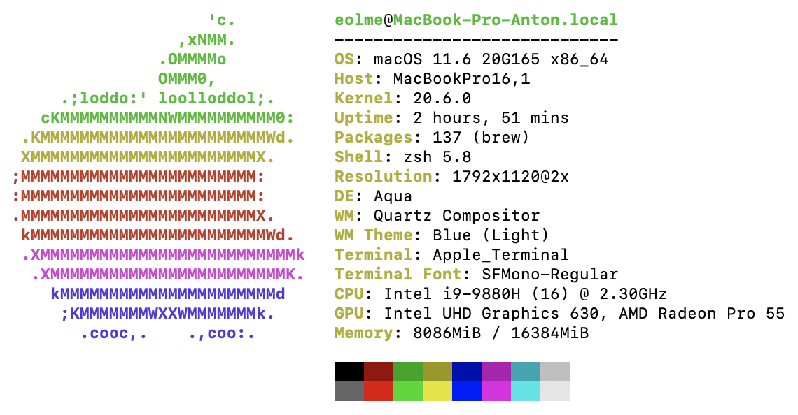

# Node FormData parsers benchmark

### 4 rounds / 10k requests

|name            |min  |max  |mid  |
|----------------|-----|-----|-----|
|formidable      |1220 |1462 |1366 |
|multiparty      |1388 |1424 |1407 |
|busboy          |1968 |2453 |2309 |
|@mntm/multipart |2850 |2903 |2877 |

### Tested on

